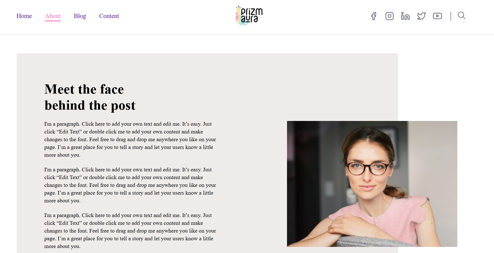
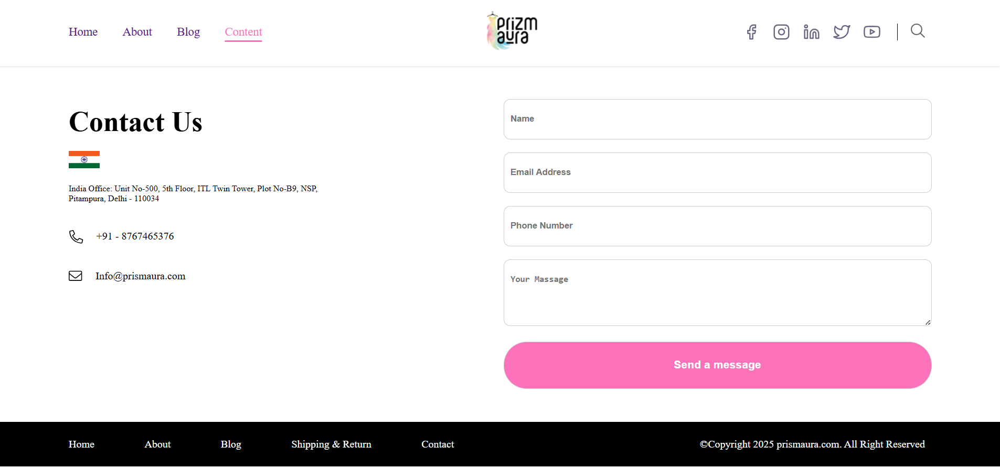

👕 Prizmora

A fully responsive Clothing E-Commerce Website built using HTML, CSS, JavaScript, PHP, and MySQL.

---

📌 Project Overview

Prizmora is a modern and responsive clothing e-commerce website designed to provide users with an easy way to explore fashion products online.

---

🚀 Technologies Used
HTML5
CSS3
JavaScript

---

✨ Features
Fully Responsive Design
Modern UI
Mobile Friendly
Product Listing System
Category Based Browsing
Easy Navigation
Cross Browser Compatible

---

## 📸 Website Preview

<h3>🏠 Home Section</h3>

<h3>ℹ️ About Section</h3>

<h3>🛠️ Blog Section</h3>

<h3>📞 Contact Section</h3>

<h3>📞 Mobile Friendly Section</h3>

---

## Run project On 
(file:///C:/Users/ADMIN/Desktop/Frontend%20Project/PROJECTS/Prizmora/index.html)

---

👨‍💻 Author
Sandeep Keshari
